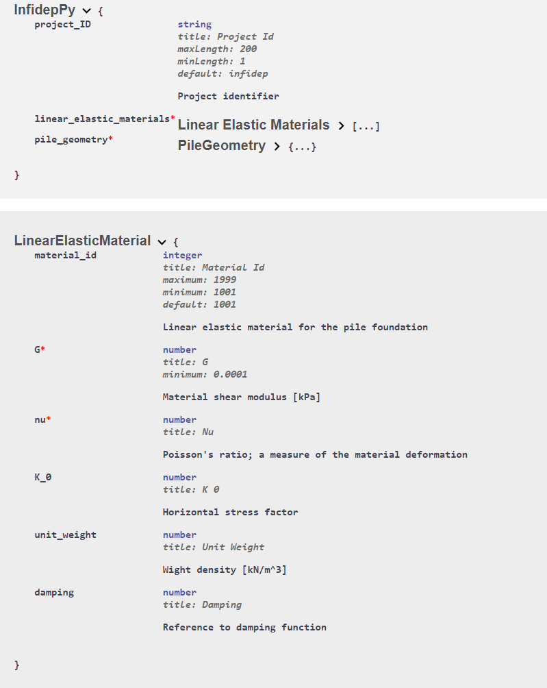

<!-- _class: title --> 
# Make model validation sexy again 


## 

####

#### Sunniva Indrehus
#### Norwegian Geotechnical Institute

---


<!-- _class: title --> 
# Make model validation sexy ~~again~~


## 

####

#### Sunniva Indrehus
#### Norwegian Geotechnical Institute

---


Who I am and what I do, background and current working place 


--- 


<!-- paginate: true -->

<!-- _footer: "  *Figure credit: [iStock](https://www.istockphoto.com/search/2/image?phrase=e%3Dmc2)* " -->

# A typical scientist 


Trys to understad a simplified version of the real world 

 
| |
|:--:|
| Figure: the horse, *credit: [Ali Bati](http://www.alibati.com/horse)* |


--- 

<!-- paginate: true -->

<!-- _footer: "  *Figure credit: [Ali Bati](http://www.alibati.com/horse)* " -->

# Typical scientist's work? 


- Understand a simplified version of the real world 


 
 


--- 

# Data Model 

> A data model is an abstract model that organizes elements of data and standardizes how they relate to one another and to the properties of real-world entities, *from [Wikipedia](https://en.wikipedia.org/wiki/Data_model)*


---


# *Example*: a complex data model 

| |
|:--:|
| Figure: a model of a turbine |


<!-- | |
|:--:|
| Figure: a simple model of a turbine + environment |


| |
|:--:|
| Figure: a bit hard model of a turbine + environment|


| |
|:--:|
| Figure: a full model of a turbine + environment| -->


--- 


<div align="center">  

# Building a data model   


 


---


<div align="center">  

# Building a data model      


 


---

<div align="center">  

# Building a data model   


 


---

<div align="center">  

# Building a data model     


 


--- 


<div align="center"> 

# :musical_note: ...  Then a (_super_)hero comes a long :musical_note:


 


--- 


# What is pydantic? 

>  **[From the official docs](https://pydantic-docs.helpmanual.io/):** *Data validation and settings management using python type annotations. Pydantic enforces type hints at runtime, and provides user friendly errors when data is invalid.*


--- 

# Class definitions

<!-- _class: split-text -->

<div class=ldiv>

```python
class LinearElasticMaterial(BaseModel):
    material_ID: int = Field(
        default=1001,
        ge=1001,
        le=1999,
        description="Linear elastic material for the pile foundation",
    )
    G: float = Field(ge=0.0001, description="Material shear modulus [kPa]")
   
    K_0: Optional[float] = Field(description="Horizontal stress factor")
    
    # ... etc. for validation
```
<!-- _Linear elastic model class_  -->

```python
class TurbineModel(BaseModel):
    soil_layers: List[SoilLayer]
    linear_elastic_materials: List[LinearElasticMaterial]
    load_step_num: int = Field(
         default=20, ge=0, description="Number of load steps in cycle"
    )
    
    # ... etc. for validation 
```
<!-- _Main class_ -->

 
</div>

<div class=rdiv>


```python
class SoilLayer(BaseModel):
    depth: float = Field(description="Depth from seabed to soil later")
    material_ID: str = Field(description="Material type of current soil layer")
    number_of_elements: int = Field(
        description="Number of elements of this material at this depth"
    )

   # ... etc. for validation 
```

</div>


--- 

# Input with dictionaries 

```python
linear_elastic_materials = {"material_ID": 1001, "G": 80800000.0}

simulation_steps = 20

turbine_model = TurbineModel(
        linear_elastic_materials=linear_elastic_material,
        load_step_num = simulation_steps
    )
```

# Error message
```python 
pydantic.error_wrappers.ValidationError: 1 validation error for LinearElasticMaterial
material_ID
  ensure this value is less than or equal to 1999 (type=value_error.number.not_le; limit_value=1999)
```


---


# Nifty integration for "free"
 
<div align="center"> 


 
*Automatic docs with fast-API* 


---


# Summary 

:boom: Pydantic let's you focus on your algorithm and not input validation  :boom:


