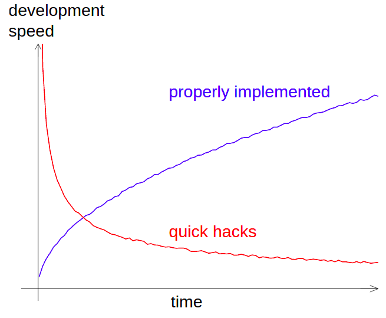

<!-- _class: title --> 
# Technical tools at OE

### Sunniva's perspective

---

<!-- paginate: true -->

# My work 

## Previous working experience 
- Phd in numerical physics 
  - Industrial and academic usage since 2001 
  - Lines of code: ~ $10^5$ 
- Previous member of the development team of [CTSM](https://github.com/ESCOMP/CTSM)
  -  Daily users: 200
  -  Lines of code: ~ $10^6$ 

--- 

<!-- _class: split-text -->
# My NGI work so far 

## Started $1^{st}$ of September 2021

### Developer tasks 
- InfidepPy-development  (wrapper task)
- Stress-module (translation task matlab2python)
- PyCOMPSS, devito (use and set-up software correcly)
- Image processing (cluster adaption)

### QA/support 
- Random questions 
- Installation problems 
- Can't run the software 
- Can't find right executable 
- My python does not work any more 
- Help to fix spyder 

---

#  
# :arrow_right: Special cases of classical software engineering problems

--- 

# Non-existing by using

<!-- _class: split-text-image -->

## Environments 

 
 *[Credit](https://www.pinterest.co.uk/pin/536209899356890025/)*

## Versioning tools 
 

---

# By exploiting these tools one can do

 

- CI/CD:
  - Perform automatic format checks 
  - Run automatic tests when code base is changing 
- Facilitates 
  - Roll back functionality
  - Code review 
- Etc.

--- 

 
*Credit: Radovan Bast*

---

# How to improve in a sustainable way?

## Suggestions
- Introduce a minimum required standard to be used in projects
- Create an environment for talking about technical computer stuff 
  - Low-key "office hours" role 
  - Internal project to write hours for infrastructure/setting up tools on 
  - L&L inspired technical talks 
- Create NGI adapted guides for installation instructions 
- Even more convincing and very long point that will cause the text formatting to break

--- 
<!-- _class: title -->  

## \#onsafeground 

