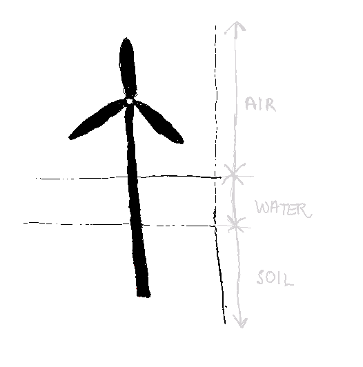
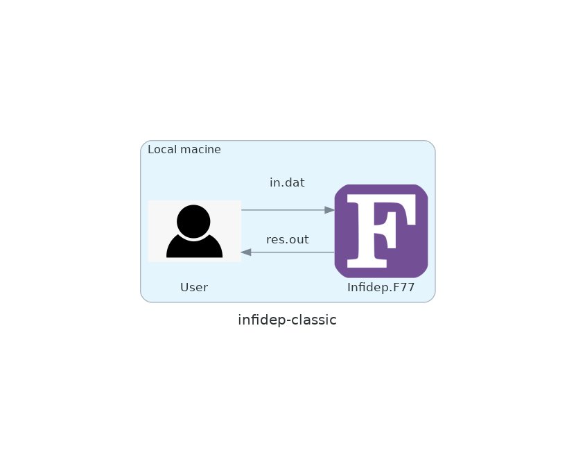
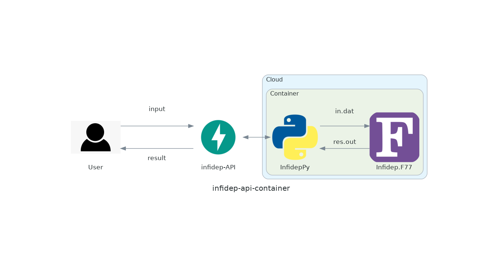

<!-- _class: title --> 
# Make model validation sexy again 


## 

####

#### Sunniva Indrehus
#### Norwegian Geotechnical Institute


---

<!-- _class: title --> 
# Keep model validation sexy again 


## 

####

#### Sunniva Indrehus
#### Norwegian Geotechnical Institute

---


<!-- _class: title --> 
# Make model validation sexy ~~again~~


## 

####

#### Sunniva Indrehus
#### Norwegian Geotechnical Institute

---


<!-- paginate: true -->

<!-- _footer: "  *Figure credit: [Ali Bati](http://www.alibati.com/horse)* " -->

# Scientist's work? 


- Understand a simplified version of the real world 


 
 


--- 

<!-- paginate: true -->

<!-- _footer: "  *Figure credit: [Ali Bati](http://www.alibati.com/horse)* " -->


# RSE's work? 


- **Code and** understand a simplified version of the real world 


 
 


--- 


# Data Model 

> A data model is an abstract model that organizes elements of data and standardizes how they relate to one another and to the properties of real-world entities.

*from [Wikipedia](https://en.wikipedia.org/wiki/Data_model)*


---


# Building a data model 

| |
|:--:|
| Figure: a model of a turbine |


--- 


# Building a data model 

| |
|:--:|
| Figure: a simple model of a turbine + environment |

--- 


# Building a data model 

| |
|:--:|
| Figure: a less simpler model of a turbine + environment|


--- 


# Building a data model 

| |
|:--:|
| Figure: a full model of a turbine + environment|

--- 


<div align="center"> 

# :musical_note: ...  Then a (_super_)hero comes a long :musical_note:


 

--- 

# What is pydantic? 

>  Data validation and settings management using python type annotations. Pydantic enforces type hints at runtime, and provides user friendly errors when data is invalid.
> 
*[From the official docs](https://pydantic-docs.helpmanual.io/)*

:star: GitHub 15.4k (22.08.23)
:package: [Downlaods per week](https://pypistats.org/packages/pydantic) $\approx$ 22M (22.08.23)


--- 

# Class definitions 

<div class="twocols">

```python
from pydantic import BaseModel, Field

class SoilLayer(BaseModel):
    depth: float = Field(description="Depth from seabed to soil later")
    number_of_elements: int = Field(
        description="Number of elements of this material at this depth"
    )
   # ... etc. for validation 
```

<p class="break"></p>

```python
class TurbineModel(BaseModel):
    soil_layers: list[SoilLayer]
    load_step_num: int = Field(
         default=20, ge=0, description="Number of load steps in cycle"
    )
    
    # ... etc. for validation 
```

</div>


--- 

# Give input with dictionaries 

```python
soil_layers = [{"depth": 0, "number_of_elements": 2},{"depth":2, "number_of_elements": 3}]

simulation_steps = 20

turbine_model = TurbineModel(
        soil_layers=soil_layers,
        load_step_num = simulation_steps
    )

print(f"My turbine model: {turbine_model}")
```

# Print message
```python 
My turbine model: soil_layers=[SoilLayer(depth=0.0, number_of_elements=2), SoilLayer(depth=2.0, number_of_elements=3)] load_step_num=20
```


---

# Give input with dictionaries 

```python
soil_layers = [{"depth": 0, "number_of_elements": 2},{"depth":2, "number_of_elements": 3}]

simulation_steps = -20

turbine_model = TurbineModel(
        soil_layers=soil_layers,
        load_step_num = simulation_steps
    )

print(f"My turbine model: {turbine_model}")
```

# "Free" error messages
```python 
pydantic.error_wrappers.ValidationError: 1 validation error for TurbineModel
load_step_num ensure this value is greater than or equal to 0 (type=value_error.number.not_ge; limit_value=0)
```


---


# Calling procedure 

| |
|:--:|
| Figure: local usage |

--- 


# Calling procedure 


| |
|:--:|
| Figure: modernized usage |


---

# Testing next

| | *Dummy*| 
|:--:| :--:|
| 
- Testing item
- Item 1 
| Text |


--- 

| Tables        | Are           | Cool  |
| ------------- |:-------------:| -----:|
| col 3 is      | right-aligned | $1600 |
| col 2 is      | centered      |   $12 |
| zebra stripes | are neat      |    $1 |
| - item1 - item2</li></ul>| See the list | from the first column|


---

<style scoped>
table {
    height: 100%;
    width: 100%;
    font-size: 20px;
    color: red;
}
th {
    color: blue;
}
</style>

# Fruit Table -- styled

Fruit | Colour | Amount | Cost
-----|------|:-----:|------:
Banana | Yellow | 4 | £1.00
Apple | Red | 2 | £0.60
Orange | Orange | 10 | £2.50
Coconut | Brown | 1 | £1.50

---

# Fruit Table -- default

Fruit | Colour | Amount | Cost
-----|------|:-----:|------:
Banana | Yellow | 4 | £1.00
Apple | Red | 2 | £0.60
Orange | Orange | 10 | £2.50
Coconut | Brown | 1 | £1.50

---

# Summary 

:boom: Pydantic let's you focus on your algorithm and not data model validation :boom:

## Other cool tools for model validation 
- [Pandera](https://pandera.readthedocs.io/en/stable/), for data-validation on dataframe-like objects 
  GitHub :star: 1.7k (currently, 18.10.22)

--- 

# [Demo repository](https://github.com/sunnivin/demo-make-model-validation-sexy-again) 

