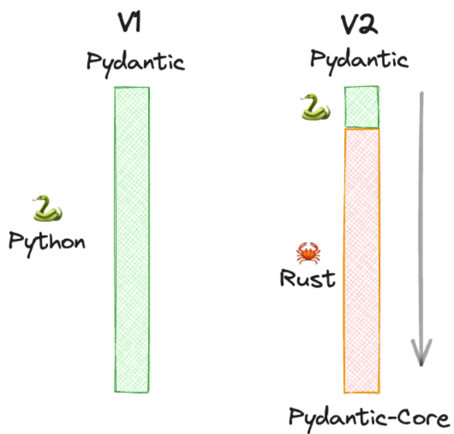

 
<!-- _class: title --> 
# Pydantic v2 

## 

 
#### 
#### Technical hour
#### Sunniva Indrehus


---

<!-- paginate: true -->

```
$ whoami
```
--- 


<!-- _footer: "  *Figure credit: [Ali Bati](http://www.alibati.com/horse)* " -->

# NGI scientist's aim 

- Understand a simplified version of the real world 

 

---

# Engineering example  

- Define a valid **data model**
- Perform operation X 
- Iterpret results

 

--- 

# Pydantic 

:boom: v2.0 released 30.06.2023 :boom: 

## What's the fuzz? 

- v2 [promise](https://docs.pydantic.dev/latest/blog/pydantic-v2-alpha/#headlines) 5-50x speed up compared to Pydantic v1
- :star: GitHub [stars](https://github.com/pydantic/pydantic) 15.4k (22.08.23)
- :package: [pr week](https://pypistats.org/packages/pydantic) $\approx$ 22M (week 34 2023)

--- 

# Pydantic

## Why?
 
:snake: Python is dynamically typed, and [PEP484 Type Hints](https://peps.python.org/pep-0484/) is not enforced during run time 

## What?

> Pydantic is the most widely used data validation library for Python.
> 
*[From the official docs](https://docs.pydantic.dev/latest/#why-use-pydantic)*

---

<!-- _footer: "  *Figure credit: [Prashanth Rao](https://thedataquarry.com/posts/why-pydantic-v2-matters/)* " -->

# Pydantic v2

## A new core 



- Validations outside of Python
- Recursive function calls with Rust and small overhead 

---

# Pydantic v2 

## Some new features
- Functionality for discriminated unions
- `pydantic.functional_validators` let you do validation without `base_model` (*e.g* a function)
- Possibility to use `TypeAdapter` instead of `BaseModel`
- You can define `field_serializer` you can do *custom serialization* 

## Examples and inspiration 
- [Migration guide](https://docs.pydantic.dev/latest/migration/)
- [v1 to v2 video example](https://www.youtube.com/watch?v=sD_xpYl4fPU)

---

# Speed-up for *free*  :unlock:


## Language changes
- `root_validator` :arrow_right: `model_validator`
- `validated_data = [Wine(**item).model_dump(exclude_none=True, by_alias=True) for item in data]`
:arrow_right:       
`validated_data = [Wine(**item).dict(exclude_none=exclude_none) for item in data]`

--- 

# Speed-up with *investements* :moneybag:

---

# Demo some benchmarking

--- 

## Example run times

Fruit | Colour | Amount | Cost
:-----|:------|:-----|:------
Banana | Yellow | 4 | £1.00
Apple | Red | 2 | £0.60
Orange | Orange | 10 | £2.50
Coconut | Brown | 1 | £1.50

--- 


# Credit 

- [Pydantic v2 Plan](https://docs.pydantic.dev/latest/blog/pydantic-v2/) (accessed 22.08.2023)
- Terrence Dorsey and Samuel Colvin [Pydantic v2 Pre Release](https://docs.pydantic.dev/latest/blog/pydantic-v2-alpha/) (accessed 22.08.2023)
- Prashanth Rao, The Data Quarry, [Obtain a 5x speedup for free by upgrading to Pydantic v2](https://thedataquarry.com/posts/why-pydantic-v2-matters/) (accessed 22.08.2023)
- Yaakov Bressler in [Medium](https://blog.det.life/dont-write-another-line-of-code-until-you-see-these-pydantic-v2-breakthrough-features-5cdc65e6b448) (accessed 22.08.2023)
- Samuel Colvin at [PyCon US 2023](https://www.youtube.com/watch?v=pWZw7hYoRVU) (accessed 22.08.2023)
- Configuring [mypy with Pydantic](https://docs.pydantic.dev/latest/integrations/mypy/#configuring-the-plugin) (accessed 22.08.2023)
