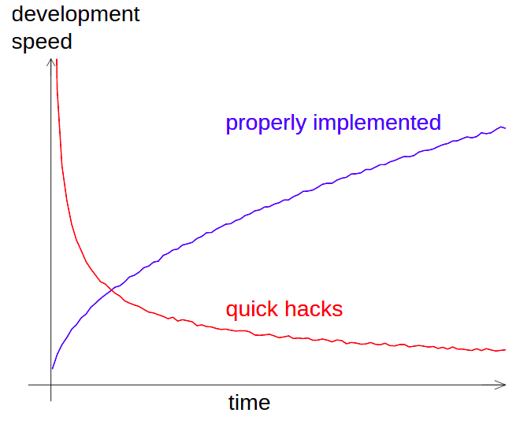

<!-- _class: title -->
# Hooked on hooks


##

####
#### Nordic-RSE online unconference 2023
#### Sunniva Indrehus

---

<!-- _class: title -->
# Hooked on hooks


## :snake: + :hook: = :sparkles:

####
#### Nordic-RSE online unconference 2023
#### Sunniva Indrehus

---

<!-- paginate: true -->

```
$ whoami
```
---

<!-- _class: split-text-image -->

# Development speed vs. time

<div class=ldiv>

##


*Figure credit: Radovan Bast*


</div>

<div class=rdiv>

##

<!-- 
*Figure Credit: [http://memegenerator.net/](http://memegenerator.net/)*
 -->


</div>


---

<!-- _class: split-text-image -->

# Development speed vs. time

<div class=ldiv>

##


*Figure credit: Radovan Bast*


</div>

<div class=rdiv>

##


*Figure Credit: [http://memegenerator.net/](http://memegenerator.net/)*


</div>

---

# Git-Hooks


- Automate actions linked to change
- Language independent
- Enforce standard(s) in repository
  - Commit messages
  - Format

##

```bash
~/hooked-on-magic(main)$ ls -la .git/
total 56
...
drwxr-xr-x  2 sunnivin sunnivin 4096 Oct 25 11:06 hooks
...
```


---

# Python

<!-- _class: split-text-image -->

<div class=ldiv>

##

- High level programming language
- Dynamically typed
  - Easy to *use and misuse*
- [Current version](https://www.python.org/doc/versions/) (25.10.23): 3.12.0

</div>

<div class=rdiv>


*Figure credit: [xkcd](https://xkcd.com/1987/)*


</div>

---

<!-- _class: split-text -->


# Our [(PEP)](https://peps.python.org/pep-0000/) best friends

<div class=ldiv>


#

#### [PEP 484](https://peps.python.org/pep-0484/)


- Type annotation
  - Released 2015-09-13
- Tool(s)
  - [mypy](https://mypy.readthedocs.io/en/stable/)

</div>


<div class=rdiv>

#

#### [PEP 8](https://peps.python.org/pep-0008/)

- Style guide for Python Code
  - Released 2013-08-01
- Tool(s)
  - [black](https://black.readthedocs.io/en/stable/) or [ruff](https://docs.astral.sh/ruff/)
  - [flake8](https://flake8.pycqa.org/en/latest/)
  - [isort](https://pycqa.github.io/isort/)

</div>


---

# [Demo](https://github.com/sunnivin/hooked-on-hooks/tree/main/demo)

---

# :snake: + PEPs + [pre-commit](https://pypi.org/project/pre-commit/) = :sparkles:


```bash
~/hooked-on-hooks$ ls -la .git/hooks
...
-rwxr-xr-x 1 sunnivin sunnivin  661 Oct 25 11:06 pre-commit
-rwxr-xr-x 1 sunnivin sunnivin 1643 Oct 25 08:24 pre-commit.sample
...
```

```bash
~/hooked-on-hooks/demo/$ cat pyproject.toml
...
[tool.poetry.dependencies]
python = "^3.12"


[tool.poetry.group.dev.dependencies]
pre-commit = "^3.5.0"
...
```
